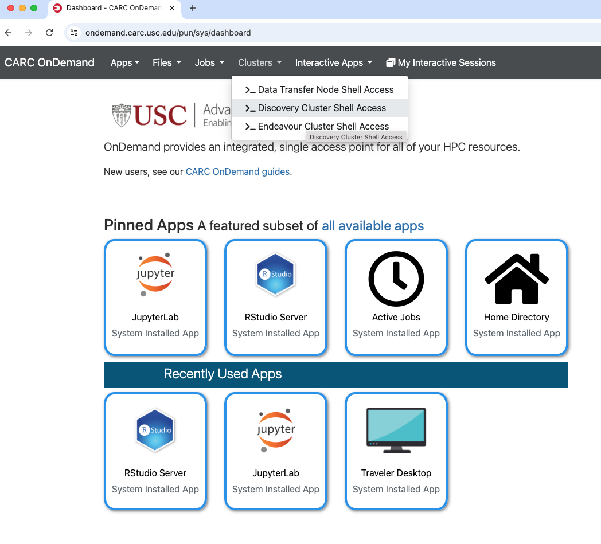
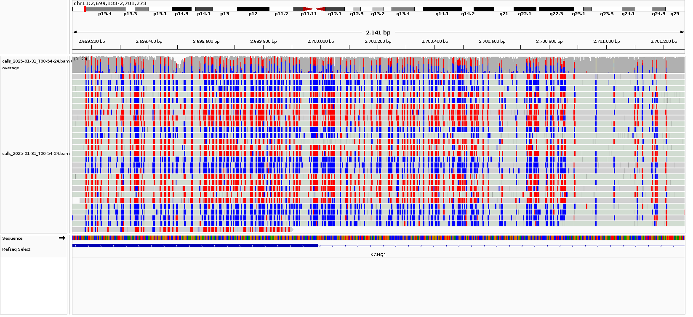
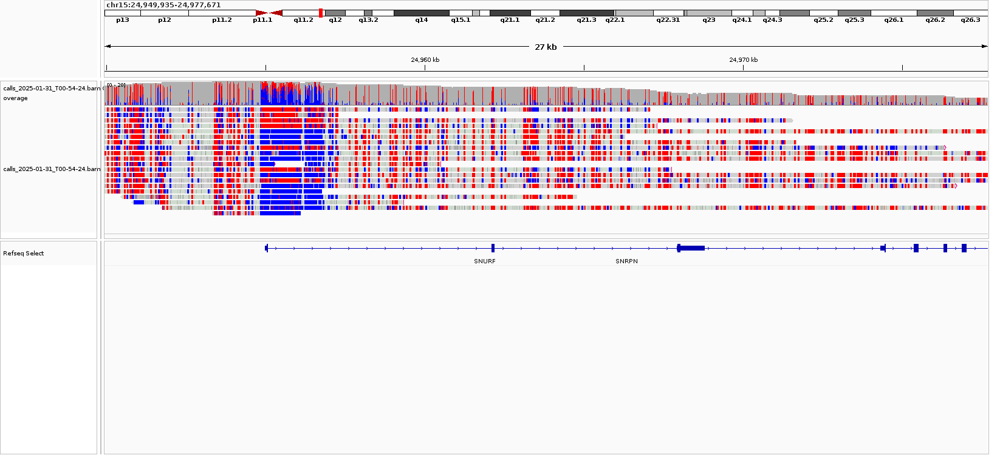
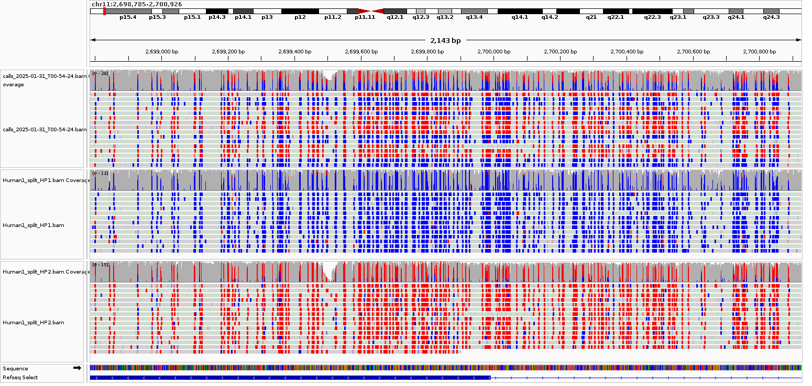

# LongVerse tutorial

Running [LongVerse](https://github.com/LabShengLi/longverse) on long-read data from
the command line: raw signal to allele-specific methylation in one command, for
Oxford Nanopore and PacBio HiFi.

LongVerse is a Nextflow DSL2 pipeline. It takes raw reads through basecalling to a
modified-base BAM, extracts per-read and per-site methylation, calls variants,
phases the reads into haplotypes, and reports methylation per haplotype.

---

## Section 1: Software Installation

### Prerequisite

You must have access to [CARC OnDemand](https://ondemand.carc.usc.edu/pun/sys/dashboard/)
and be able to start a Cluster Shell Access session.



### Enter into interactive mode

**Note**: if you are already in compute node mode, you don't need to do this step.

This command starts an interactive session on the cluster with multiple CPU cores
and memory. More information in the
[Slurm Job documents](https://www.carc.usc.edu/user-guides/hpc-systems/using-our-hpc-systems/slurm-templates.html)
for CARC HPC.

```bash
salloc -p main,largemem,oneweek -N 1 -c 8 --mem 32G --time 2:00:00
nproc    # 8
```

`-c 8` is one task with eight cores; `-n 8` is eight tasks with one core each, and
an interactive shell on the second of those sees a single core.

**Note: You must enter the `compute` (`interactive`) mode to load and run most
software, not the `login` mode.**

Pick a partition whose limit fits your `--time`. `debug` is capped at one hour, so
asking it for two is rejected before anything starts.

---

Create and enter a directory for this session's work:

```bash
wdir="/scratch1/$USER/longverse_tutorial"
mkdir -p $wdir
cd $wdir
pwd
```

### What LongVerse needs

Nextflow, Java 17 or newer, and one container engine. That is the whole list.

This is the part that differs most from calling the tools by hand. A hand-written
workflow has to pull each image, download each basecalling model and stage each
input before it can start. LongVerse resolves all of that from the run command, so
there is nothing to install per tool and nothing to keep in step with the pipeline
version.

#### Singularity container

[**Singularity**](https://docs.sylabs.io/guides/3.5/user-guide/introduction.html)
is a container technology designed to run applications in a portable and
reproducible way, especially in high-performance computing environments. Unlike
Docker, which often requires administrator (root) privileges, Singularity is built
to work securely on shared systems where users do not have root access.

Singularity packages all the software, libraries and dependencies of a workflow
into a single container file, so the analysis runs the same way on any system
regardless of the underlying operating system or installed software.

```bash
module load apptainer
singularity --version
```

#### Install Java and Nextflow

Nextflow requires Java 17 or higher.

```bash
module spider openjdk
module load openjdk/21.0.0_35
```

[Nextflow](https://www.nextflow.io/docs/latest/install.html#install-nextflow) can
be installed with a single command:

```bash
curl -s https://get.nextflow.io | bash
./nextflow -v
```

Or by module:

```bash
module purge
module load ver/2506 gcc/14.3.0 openjdk/21.0.7_6 nextflow/25.04.8 apptainer
```

On this cluster all three are already installed, so one PATH line is enough:

```bash
# [CARC]
export PATH=/apps/generic/apptainer/1.5.3/bin:/apps/generic/openjdk/25.0.2/bin:/apps/generic/nextflow/25.10.4/bin:$PATH
```

#### The container image cache

Images total several GB, so put the cache on a filesystem with room, not in a
quota-limited home directory.

```bash
# [CARC] A shared cache already holds every image this tutorial needs, world
# readable, so nothing is downloaded on this cluster.
export NXF_SINGULARITY_CACHEDIR=/scratch1/yliu8962/longverse_cache
```

Elsewhere, point it at a directory of your own and let Nextflow fill it:

```bash
export NXF_SINGULARITY_CACHEDIR=$HOME/longverse_cache
```

The shared cache is readable but not writable by anyone else, which is enough:
Nextflow writes nothing into the cache directory when every image it needs is
already there, verified by running against a read-only copy. If a run ever does
need an image the cache does not hold, point the variable at a directory of your
own and that run fills it.

#### If a run fails on a Ref that does not exist

`-latest` re-pulls the pipeline before running, which is what keeps a cached copy
from going stale. If the cached copy is checked out on a branch that has since been
deleted, that same flag is what fails:

```
Pulling LabShengLi/longverse ...
Remote origin did not advertise Ref for branch refs/heads/<branch>.
This Ref may not exist in the remote or may be hidden by permission settings.
```

Nextflow keeps pipelines under `$NXF_HOME/assets`, and a copy pulled from a branch
stays on that branch. Nothing is wrong with your command; the local copy is
pointing at something the remote no longer has. Drop it and pull again:

```bash
nextflow drop LabShengLi/longverse
nextflow pull LabShengLi/longverse
```

This only affects people who ran the pipeline before. A first run has no cached
copy and goes straight to the default branch.

Full script: [Session1_setup.sh](script/Session1_setup.sh)

---

## The data

A 120,358 bp window around the GNAS imprinted locus on chromosome 20 of HG002,
aligned to CHM13v2.0 (T2T), published on Zenodo at
[10.5281/zenodo.20116126](https://doi.org/10.5281/zenodo.20116126). ONT and PacBio
HiFi versions of the same locus, a few MB each.

GNAS is imprinted, which is the point: the two haplotypes genuinely differ, so a
run that phases correctly produces two clearly different methylation profiles
rather than two copies of the same thing.

Nothing has to be downloaded first. The commands below reference the Zenodo URLs
and Nextflow stages them.

Sections 2 and 3 are each complete on their own: allocation, working directory,
setup and the run command. Copy either one whole and it works. On this cluster the
tools are already installed and the image cache is already filled, so a run
downloads nothing but the few MB of test data.

**The contig is not called `chr20`.** The reference is a window and its single
contig is named `chr20:60574425-60694782`. That string is the whole contig name,
not a region on chr20, and positions inside it start at 1. Passing the bare
chromosome name to `--chrSet` does not fail: it produces an empty result and
exits 0.

---

## Section 2: ONT, raw signal to per-haplotype methylation

This section stands on its own: everything needed is below, Section 1 is the
explanation of why.

Get a compute node first, unless you are already on one. Do not run this on a
login node, the basecalling step is real computation.

```bash
salloc -p main,largemem,oneweek -N 1 -c 8 --mem 32G --time 2:00:00
nproc    # 8
```

Ask for the cores with `-c`, not with `-n`. In a batch script the two behave the
same, which is why the difference is easy to miss, but an interactive shell is a
Slurm *step* and there they part company. `-c 8` is one task holding eight cores.
`-n 8` is eight tasks of one core each, so Slurm starts eight shells, attaches you
to one of them, and that one has a single core. `squeue` says `cpus=8` either way.
Measured here: `nproc` is 8 from a `-c 8` shell and 1 from a `-n 8` one, and a full
ONT run took 133 s against 392 s.

Then one block, start to finish:

```bash
# A working directory. Everything the run writes goes here.
mkdir -p /scratch1/$USER/longverse_tutorial && cd /scratch1/$USER/longverse_tutorial

# [CARC] Three lines of setup. Section 1 explains them; what they do is find the
# tools, reuse the shared image cache instead of downloading 34 GB again, and put
# TMPDIR somewhere the container can see.
export PATH=/apps/generic/apptainer/1.5.3/bin:/apps/generic/openjdk/25.0.2/bin:/apps/generic/nextflow/25.10.4/bin:$PATH
export NXF_SINGULARITY_CACHEDIR=/scratch1/yliu8962/longverse_cache
export TMPDIR=$PWD/tmp; mkdir -p "$TMPDIR"

Z=https://zenodo.org/records/23090404/files

nextflow run LabShengLi/longverse -latest -profile singularity --dsname ont \
    --input $Z/chr20_GNAS_ont_pod5.tar.gz --genome $Z/chr20_GNAS_ref.tar.gz \
    --platform ont --ecosystem dorado --input_bam false --file_format pod5 --phasing true \
    --dorado_basecall_model 'dna_r10.4.1_e8.2_400bps_hac@v4.1.0' \
    --dorado_methcall_model 'dna_r10.4.1_e8.2_400bps_hac@v4.1.0_5mCG_5hmCG@v2' \
    --chrSet chr20:60574425-60694782 --ctg_name chr20:60574425-60694782 \
    --clair3_platform ont --CLAIR3_MODEL_NAME r1041_e82_400bps_hac_v410 \
    --outdir ont --containerOptions "-B $PWD"
```

Fifteen steps: Dorado basecalls the POD5 and calls 5mC, the methylation is
extracted per read and unified per site, Clair3 calls variants, whatshap splits the
reads into HP1 and HP2, and the methylation is re-extracted for each haplotype.
**2 min 57 s** on four CPU cores, no GPU.


**`DORADO_CALL` goes quiet, and that is not a hang.** Dorado prints nothing
between loading the POD5 and finishing, so the last thing on screen stays

```
[debug] Load reads from file ont.untar/hg002_ont_chr20_GNAS.pod5
```

for the whole basecall. Measured here: 138 seconds of silence on an idle 64-core
node, then `Finished in (ms): 133312` and 88 reads. On a busy shared node it is
several times that, because Dorado sizes its CPU runner pool from the cores it can
see on the machine and not from the cores Slurm gave you, so it oversubscribes and
then competes with whatever else is running. To tell waiting from stuck, look at
the process rather than the log:

```bash
ps -u $USER -o pid,%cpu,etime,comm | grep -i dorado
```

High `%CPU` means it is working. Near zero means something is wrong.

Script: [Session2_ont_one_command.sh](script/Session2_ont_one_command.sh) ·
Console output: [Session2_ont.log](script/Session2_ont.log)

---

## Section 3: PacBio HiFi, kinetics to per-haplotype methylation

This section stands on its own: everything needed is below, Section 1 is the
explanation of why.

Get a compute node first, unless you are already on one. Do not run this on a
login node, the basecalling step is real computation.

```bash
salloc -p main,largemem,oneweek -N 1 -c 8 --mem 32G --time 2:00:00
nproc    # 8
```

Ask for the cores with `-c`, not with `-n`. In a batch script the two behave the
same, which is why the difference is easy to miss, but an interactive shell is a
Slurm *step* and there they part company. `-c 8` is one task holding eight cores.
`-n 8` is eight tasks of one core each, so Slurm starts eight shells, attaches you
to one of them, and that one has a single core. `squeue` says `cpus=8` either way.
Measured here: `nproc` is 8 from a `-c 8` shell and 1 from a `-n 8` one, and a full
ONT run took 133 s against 392 s.

Then one block, start to finish:

```bash
# A working directory. Everything the run writes goes here.
mkdir -p /scratch1/$USER/longverse_tutorial && cd /scratch1/$USER/longverse_tutorial

# [CARC] Three lines of setup. Section 1 explains them; what they do is find the
# tools, reuse the shared image cache instead of downloading 34 GB again, and put
# TMPDIR somewhere the container can see.
export PATH=/apps/generic/apptainer/1.5.3/bin:/apps/generic/openjdk/25.0.2/bin:/apps/generic/nextflow/25.10.4/bin:$PATH
export NXF_SINGULARITY_CACHEDIR=/scratch1/yliu8962/longverse_cache
export TMPDIR=$PWD/tmp; mkdir -p "$TMPDIR"

Z=https://zenodo.org/records/23090404/files

nextflow run LabShengLi/longverse -latest -profile singularity --dsname pacbio \
    --input $Z/chr20_GNAS_pacbio_kinetics.tar.gz --genome $Z/chr20_GNAS_ref.tar.gz \
    --platform pacbio --ecosystem jasmine --input_bam false --file_format bam --phasing true \
    --chrSet chr20:60574425-60694782 --ctg_name chr20:60574425-60694782 \
    --clair3_platform hifi --CLAIR3_MODEL_NAME hifi_sequel2 \
    --outdir pacbio --containerOptions "-B $PWD"
```

The same sixteen steps with one difference at the front: **PacBio has no
basecalling step of its own**. A HiFi BAM already carries the polymerase kinetics
and Jasmine calls 5mC from them. Everything after that, alignment with pbmm2,
extraction, Clair3, phasing, is the shared stack. **1 min 03 s**.

Script: [Session3_pacbio_one_command.sh](script/Session3_pacbio_one_command.sh) ·
Console output: [Session3_pacbio.log](script/Session3_pacbio.log)

---

## Section 4: Results

```
ont/
├── ont-methylation-callings/
│   ├── Raw_Results-ont/ont.dorado_call/   modBAM + bai, straight out of Dorado
│   ├── Read_Level-ont_{all,HP1,HP2}/      per-read CpG calls
│   └── Site_Level-ont_{all,HP1,HP2}/      per-site methylation, NANOME / methylKit / DSS formats
├── ont-vcall/
│   ├── ont_clair3_out/                    variants
│   └── ont_phased_bam/ont_{HP1,HP2}/      the haplotype BAMs
├── ont-LVQC/                              read length, quality, coverage
├── ont_DMC/                               differentially methylated cytosines, HP1 vs HP2
└── ont-run-log/                           per-step run logs
```

Run times, the step lists and how to tell a run actually worked are in
[Session_jobinfo.md](script/Session_jobinfo.md).

### Already-made results

If you want to look at the output without running anything first, the BAMs from
the run recorded here are in [`data/`](data/):

```
data/
├── ont_chr20_GNAS.all.bam          89 reads, all of them, before phasing
├── ont_chr20_GNAS.HP1.bam          34
├── ont_chr20_GNAS.HP2.bam          31
├── pacbio_chr20_GNAS.all.bam      103
├── pacbio_chr20_GNAS.HP1.bam       38
└── pacbio_chr20_GNAS.HP2.bam       46
```

Each has its `.bai`, all six are on the same contig, and the reference they need
is `chm13v2.0.chr20_GNAS_readspan.fa` from the `chr20_GNAS_ref` archive on Zenodo.
The inputs are not kept here, because they are already published and the commands
above fetch them.

HP1 and HP2 do not add up to `.all`: reads that cover no heterozygous site cannot
be assigned to a haplotype.

### IGV visualization of methylation states in BAM file

Open OnDemand Traveller Desktop, start IGV Viewer, and load either your own run's

```
ont/ont-methylation-callings/Raw_Results-ont/ont.dorado_call/ont.dorado_call.bam
```

or the copy in [`data/ont_chr20_GNAS.all.bam`](data/).

That is every read, straight out of Dorado, with the MM/ML tags on it. To see the
methylation:

1. Right-click anywhere on the reads, not on the track name at the left.
2. Hover `Color alignments by`.
3. Choose `base modification 2-color (5mC)`.

The submenu offers 5mC and 5hmC separately because the methylation model here is
`5mCG_5hmCG`, so every read carries both a `C+m` and a `C+h` tag. Take 5mC.





### IGV visualization of haplotype phasing

Load the two haplotype BAMs from `pacbio/pacbio-vcall/pacbio_phased_bam/`, or
[`data/pacbio_chr20_GNAS.HP1.bam`](data/) and its HP2 counterpart, as separate
tracks. At an imprinted locus the two tracks separate cleanly, which is
what a correct phasing looks like.



---

## Adapting this elsewhere

Lines marked `[CARC]` are specific to the USC CARC cluster: where Apptainer, Java
and Nextflow live, and where the shared image cache is. Replace those and the rest
works anywhere. With Docker, use `-profile docker` and drop `--containerOptions`,
since Docker mounts what Nextflow uses.

## Links

* Pipeline: [LabShengLi/longverse](https://github.com/LabShengLi/longverse)
